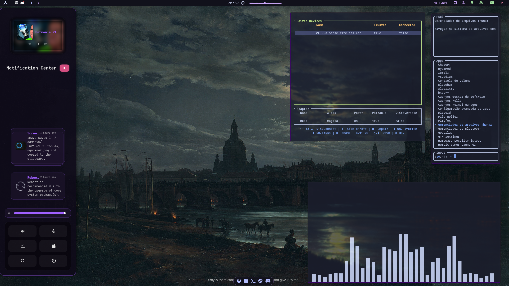

# VM DOTS

The following is a repository containing some of my personal dotfiles for a few systems.

## MAGALA

### Components

| Function | Packages |
| --- | --- |
| WM ecossystem | hyprland (and hyprmod) |
| Screenshotting |  hyprshot  |
| Lockscreen |  hyprlock  |
| Bar and Dock | waybar (cava for audio widget) |
| Notifications | swaync |
| Logout menu | wlogout |
| Application launcher | fsel |
| Terminal | kitty |
| shell | fish |
| Audio  | wiremix |
| System monitor   |  btop |
| GTK/Qt  | kvantum, nwg-look |
| Text editor | micro |
| Display manager | sddm |
| Networking | impala |

### Demo


> Wallpaper: View of Dresden by Moonlight, by Johan Christian Dahl

### Layout

`magala/dotfiles/` contains the dotfiles. Each top-level directory is a Stow
package: user packages deploy into `$HOME`, while `sddm` deploys into `/`.

`magala/system/` contains non-Stow system configuration, currently the IWD
and NetworkManager patches.

### Installation (Arch-based)

Clone the repository as the desktop user using one of the following methods:

HTTPS: [https://github.com/Vitroror/dots-magala.git](https://github.com/Vitroror/dots-magala.git)

SSH: `git@github.com:Vitroror/dots-magala.git`

GitHub CLI: `gh repo clone Vitroror/dots-magala`

Then run:

```bash
cd ~/dots-magala
./magala/install.sh
```

For example, with HTTPS:

```bash
git clone https://github.com/Vitroror/dots-magala.git ~/dots-magala
cd ~/dots-magala
./magala/install.sh
```

The installer installs the recorded official and AUR packages, deploys the
Stow packages, configures IWD/NetworkManager, enables the required services,
sets GTK/icon defaults, and configures Fish as the login shell. Reboot once it
completes.
